# Industry Specialist Pack - Mod
This mod adds Specialists focused on Industry Buildings with new AreaEffects into Anno 117. This Mod is part as a submod of "Extended Specialists Mod"
***
### Item Overview (AI Generated - Might contain Issues. Please point them out if you find some)
***

### Common Specialists
| Image Preview | GUID | Internal Name | Itemname | Description | Targets | Base Effects |
| :---: | :---: | :---: | :---: | :---: | :---: | :---: |
| 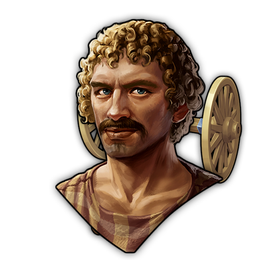 | 1600000284 | Specialist AE-AllProd-Income-Stack-C | Supplier | Fulfills delivery orders for residents in the surrounding area. Note: This Area Effect only affects Residences but is allowed to stack on them. (Industry-AreaEffects-Pack)| All Production Buildings | Area Effect: • +0.5 Money  • This buff is stackable but only on Residences.|

***

### Rare Specialists
| Image Preview | GUID | Internal Name | Itemname | Description | Targets | Base Effects |
| :---: | :---: | :---: | :---: | :---: | :---: | :---: |
| 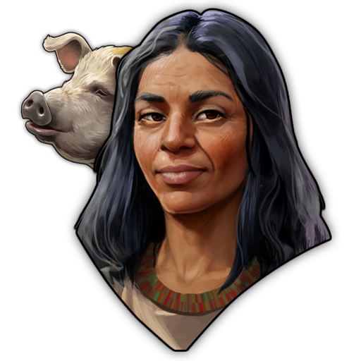 | 1600000408 | Specialist AE-Animals-Happy-NProdHealth-R | Unconventional Pet Breeder | "Pigs and sheep can also be kept as pets." (Industry-AreaEffects-Pack)| All: Sheep pastures, Pig pastures, Horse pastures | Area Effect: • +1 Money • +1 Happiness • -1 Health |
|  | 1600000254 | Specialist AE-Armories-Money-NHealthHappy-R | Irresponsible Arms Trader | "Everyone should have at least one, if not several, weapons! What could possibly go wrong?"(Industry-AreaEffects-Pack)| All Armories | Area Effect: • +2 Money • -0.5 Happiness • -0.5 Health • -0.5 FireSafety|
|  | 1600000266 | Specialist AE-Crafters-Know-NHealth-R | Practice-oriented Instructor | "Only through practice you can solidify knowledge!... Ouch! Medicus!"(Industry-AreaEffects-Pack)| All: Workshops, Refineres, Artisanal Studios | • Area Effect: • +2 Knowledge  • -1 Health|
| 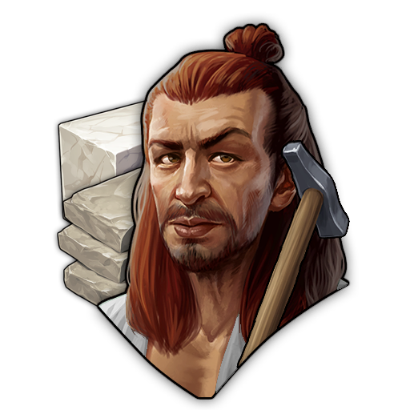 | 1600000309 | Specialist AE-StoneCutter-Money-NHealth-R | Independent Sculptor | Uses the best stone in the region to create busts of his clients.(Industry-AreaEffects-Pack)| Marble Cutter, Granite Cutter | Area Effect: • +3 Money  • -2 Health |
| 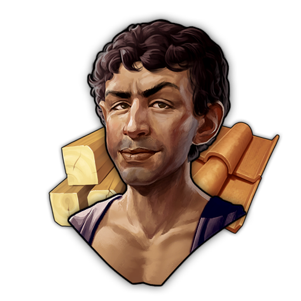 | 1600000404 | Specialist AE-MatProd-FireS-NProd-R | Local Carpenter | Is responsible for the maintenance of all nearby buildings. (Industry-AreaEffects-Pack)| All Refineries | Area Effect: • +2 FireSafety • Factory Productivity: -25% |

***

### Epic Specialists
| Image Preview | GUID | Internal Name | Itemname | Description | Targets | Base Effects |
| :---: | :---: | :---: | :---: | :---: | :---: | :---: |
| 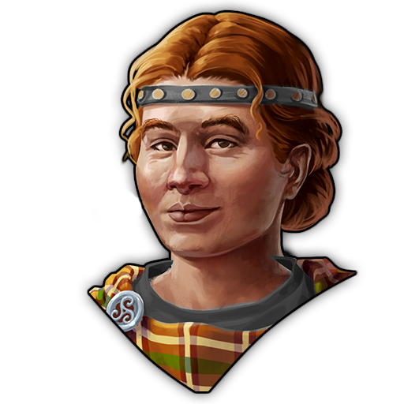 | 1600000420 | Specialist AE-Fibularium-MoneyBelief-E | Nova Fibbularia, Renowned Brooch Designer | Her brooches are the most sought-after in the entire kingdom. | Fibularium | Area Effect:  • +1 Money • +1 Belief • Factory Productivity: +15% |
| 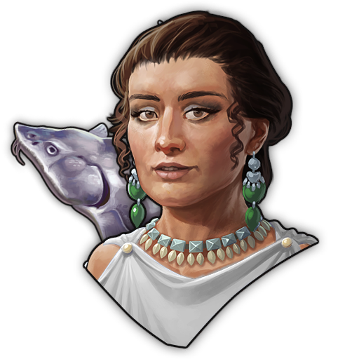 | 1600000400 | Specialist AE-Caviar-Belief-NPresti-E | Occultia, Fish Reader | "The guts are telling me... you'll find your true love. Soon..." | Fish Gutter | Area Effect:  • +3 Belief • -1 Prestige • Factory Productivity: +15%  |
|  | 1600000258 | Specialist AE-Kitchen-PrestigeHappy-E | Talented Artistic Cook | Cooking is like an inspiring performance. But who’s going to clean up the mess? | All Kitchens | Area Effect:  • +1 Prestige • +1 Happiness • Factory Productivity: +15%  |
| 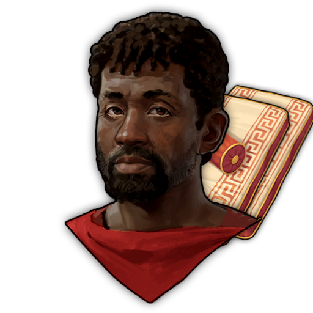 | 1600000412 | Specialist AE-Cushion-MoneyPrestHappy-E | Pa-nefer, Cuddly Pillow Manufacturer | "I wonder if it's possible to make pillows shaped like sharks? Carcharias Softis would be absolutely amazing!" | Cushion Stuffer | Area Effect:  • +0.5 Money • +1 Prestige • +0.5 Happiness • Factory Productivity: +15%  |
| 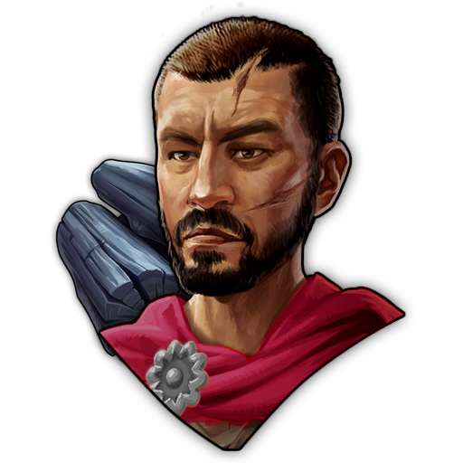 | 1600000134 | Specialist AE-FuelConsumer-FireS-NProd-E | Strictus Vaporosus II, Safety Paragraph Rider | "According to Section 5, Subsection 2 A of the Roman Fire Safety Regulations, this fireplace may only be used between sunrise and the noon assembly! Subsection 12, G, also states...." | Coal-dependent Buildings | Area Effect:  • +2 FireSafety |
| 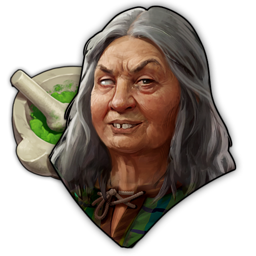 | 1600000642 | Specialist AE-CGreen-HealthBelief-E | Cernunia Aricin, Green Alchemist | Her alchemy might even benefit the general health of the community.. | Greenhands | Area Effect:  • +1 Health • +0.5 Belief • Factory Productivity: +15%  |
|  | 1600000646 | Specialist AE-Headpiece-FireSPresti-E | Experienced Headrest Upholsterer | His headpieces are surprisingly sturdy. | Headpiece Maker | Area Effect:  • +1 FireSafety • +1 Prestige • Factory Productivity: +15%  |

### Legendary Specialists
| Image Preview | GUID | Internal Name | Itemname | Description | Targets | Base Effects | Boosted Effects | Boost Condition |
| :---: | :---: | :---: | :---: | :---: | :---: | :---: | :---: | :---: |
|  | 1600000424 | Specialist AE-Amphores-PopFireS-AddGoods-L | The Invisible Amphora Artist | This citizen uses a technique to make amphorae highly fire-resistant. However, no one knows his name... and he hardly stands out. | Roman Potter, Celtic Potter | Area Effect: • +0.5 Population • +2 FireSafety • Factory Output: +1 Amphores (Cycle 10) | Area Effect: • +1 Population • +3 FireSafety • Factory Output: +1 Amphores (Cycle 4) | Needs 5000 Population on Island |
|  | 1600000657 | Specialist AE-HairWig-Health-Prod-L | Lucius Capillus Calvus, The Hair Oracle | "Go to Calvus if you don't want to be a Calvus anymore." | Wig Maker | Area Effect: • +1.5 Health • +0.5 FireSafety • Factory Productivity: +10% | Area Effect: • +2 Health • +1 FireSafety • Factory Productivity: +50% | Needs 2 Aqueduct Basin on Island |
| 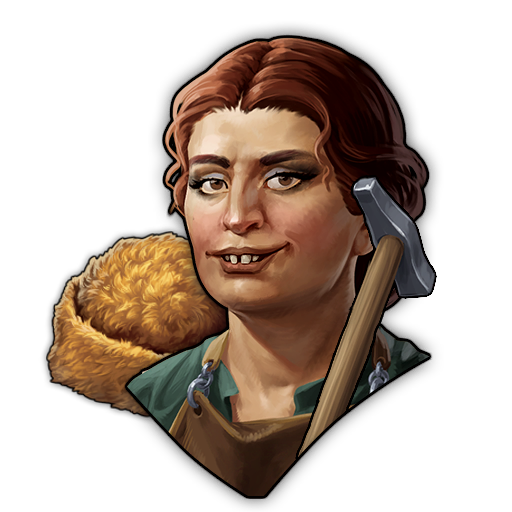 | 1600000650 | Specialist AE-Birrus-PopPresti-Prod-L | Bevera, Protective Hatmaker | Their hats can withstand any storm in Albion. | Beaver Hatter | Area Effect: • +1 Population • +1 Prestige • Factory Productivity: +10% | Area Effect: • +1 Population • +3 Prestige • Factory Productivity: +50% | Needs 125 Alderman Residences on Island |
| 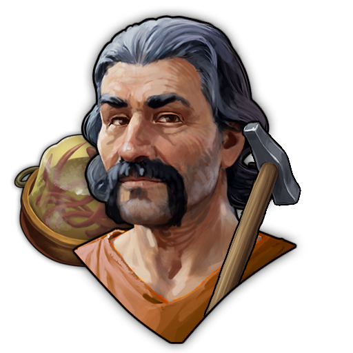 | 1600000678 | Specialist AE-BTongue-Money-AddGoods-L | Malleator Linguis, Tongue Hammerer | His way of preparing bird tongues makes the taste a little more bearable. I wonder what role the hammer plays in that? | Epicure of Air | Area Effect: • +1.5 Money • +0.5 Prestige • Factory Output: +1 Bird Tongues in Aspic (Cycle 10) | Area Effect: • +3 Money • +1 Prestige • Factory Output: +1 Bird Tongues in Aspic (Cycle 4) | Needs 9 Custodes on Island |
|  | 1600000621 | Specialist AE-Lounger-HappyMoney-Prod-L | Livia Lectuaria, The Cunning Queen of Loungers | "Anyone who dozes off on a Lectuaria lounger has already decided to buy it. Taking a nap is considered a binding declaration of intent to purchase the piece of furniture. No returns due to drool stains." | Chair Maker | Area Effect: • +1 Happiness • +1.5 Money • Factory Productivity: +25% | Area Effect: • +1 Happiness • +2 Money • Factory Productivity: +75% | Needs 150 Patrician Residences on Island |
|  | 1600000416 | Specialist AE-Chariot-PopHealth-Prod-L | Glano Tascio, Perfectionist Carriage Builder | His fast and sturdy chariots are ideal for racing. Even when serving for the Auxillia, his Celtic mettle shines through. | Chariot Workshop | Area Effect: • +1 Population • +1 Health • +1 Prestige • Factory Productivity: +10% | Area Effect: • +1 Population • +1 Health • +2 Prestige • Factory Productivity: +40% | Needs 2 Equitum Campus on Island |
|  | 1600000432 | Specialist AE-Lyre-KnowFireS-Prod-L | He-Ma-Te, Inspiring Lyre Maker | The sound of their lyres inspires all listeners to new innovations. | Lythier | Area Effect: • +1 Knowledge • +0.5 FireSafety • Factory Productivity: +15% | Area Effect: • +2 Knowledge • +1 FireSafety • Factory Productivity: +50% | Needs 8 Lyremaker on Island |
|  | 1600000664 | Specialist AE-Mirror-PopMoney-Prod-L | Narcissicus, the sturdy Mirrormaker | No soul will ever be hurt and need seven years to heal, because his mirrors can never break. | Narcissium | Area Effect: • +1 Population • +1 Money • Factory Productivity: +10% | Area Effect: • +1 Population • +2 Money • Factory Productivity: +50% | Needs 4 Fanum on Island |
| 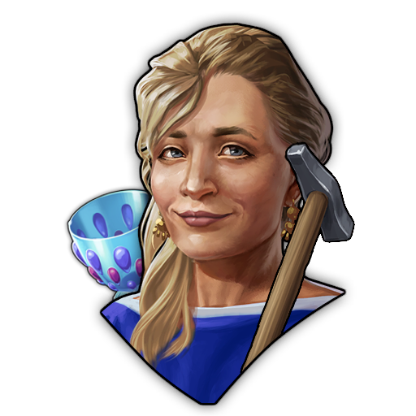 | 1600000671 | Specialist AE-RGlass-BeliefMoney-AddGoods-L | Decima Rima, Artifex Fragilis | "How am I supposed to sell more glass if it never breaks?" | Glassblower | Area Effect: • +1 Belief • +1 Money • Factory Output: +1 Fine Glass (Cycle 10) | Area Effect: • +2 Belief • +2 Money • Factory Output: +1 Fine Glass (Cycle 4) | Needs 10 Taverns on Island |
| 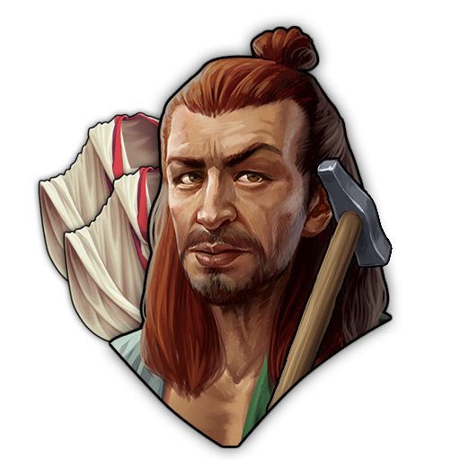 | 1600000635 | Specialist AE-Toga-PopMoney-AddGoods-L | Vercanomagus, Creative Tailor | He often asks himself: “How can you pair a toga with pants?” | Loom Weavery | Area Effect: • +1 Population • +1 Money • Factory Output: +1 Togas (Cycle 10) | Area Effect: • +1 Population • +2 Money • Factory Output: +1 Togas (Cycle 4) | Needs 10 Medicus on Island |
| 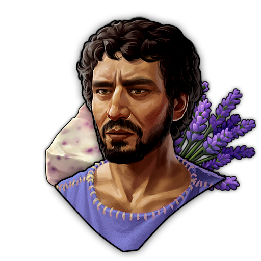 | 1600000688 | Specialist AE-Soap-HappyBelief-AddGoods-L | Phileros, Saponarius Amoris | With his new formula, he adds fresh, soft scents to the soap and brings a touch of Amor to the streets. | Soap Maker | Area Effect: • +1 Happiness • +1 Belief • Factory Output: +1 Soap (Cycle 10) | Area Effect: • +1 Happiness • +3 Belief • Factory Output: +1 Soap (Cycle 4) | Needs 5000 Prestige on Island |
| 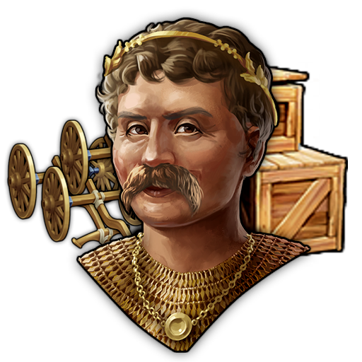 | 1600000628 | Specialist AE-AllProd-Income-Stack-L | Manlius Portus Magnus, Praebitor Maximus | He bought up the entire supply of Aegyptian papyrus just to fold it into shipping boxes and supply every single store, no matter how small, with them. Surprisingly, everyone uses his service. | All Production Buildings | Area Effect: • +1 Money  • This buff is stackable but only on Residences.| Area Effect: • +2 Money  • This buff is stackable but only on Residences. | Needs 42 Production Buildings on Island |
